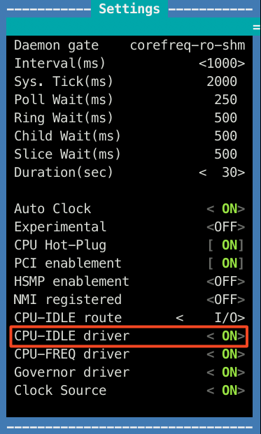
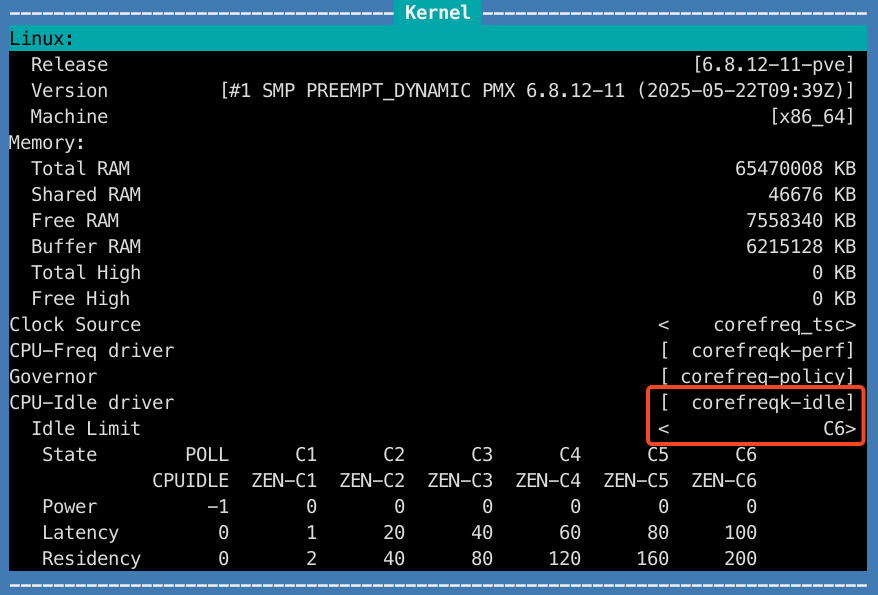
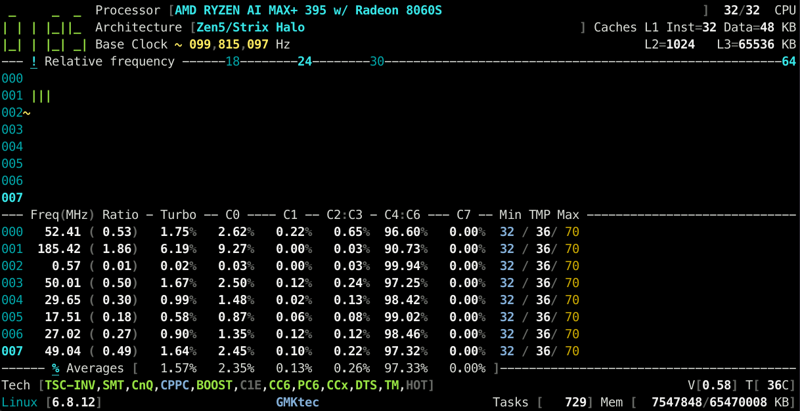

# C-States

### Problem
When running Linux, especially older 6.x kernels, you might find that the CPU doesn't use C-states below C1, constantly running on higher frequences and eating power.

### Solution
For some reason I couldn't make it work with either `acpi_cpufreq` or `amd_pstate`, but [CoreFreq](https://github.com/cyring/CoreFreq) turned out to be a perfect solution once again.

Assuming that you already have it installed and working (otherwise check [this guide](./Hardware_Monitoring.md) first):

```bash
# /etc/kernel/cmdline
... initcall_blacklist=acpi_cpufreq_init nmi_watchdog=0 idle=halt amd_pstate=disable tsc=unstable nowatchdog
```

```bash
# /etc/modprobe.d/blacklist.conf
k10temp
acpi_cpufreq
```

```bash
# /etc/modprobe.d/corefreqk.conf
options corefreqk Register_ClockSource=1 Register_CPU_Freq=1 Register_Governor=1 Register_CPU_Idle=1 Override_SubCstate="1,1,1,1,1,1,0,0"
```

Don't forget to run `update-initramfs -u -k all` and reboot after making these changes.

To check that it works, run `corefreq-cli` and go first to **Menu > Settings**, make sure that CPU-IDLE driver is ON:


Then go to **Menu > Kernel data**, make sure that CPU-Idle driver is set to `corefreqk-idle` and that the Idle Limit is set to C6:


Finally, in the **Frequency** or **Idle C-States** views you'll be able to see that the CPU now actually goes to lower frequencies/power:

