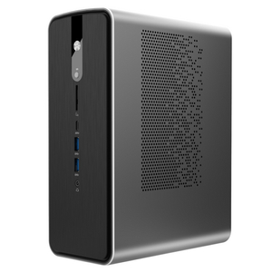

# Sixunited AXB35-02

[[OFFICIAL PRODUCT PAGE](https://www.sixunited.com/)] - Unavailable

The reference Sixunited mini PC based on [[the AXB35 board family|Hardware/Boards/Sixunited_AXB35]]. It debuted with AMD Strix Halo options up to Ryzen AI Max+ 395 and an advertised configurable profile up to 120 W TDP.

Availability: expected in May 2025.

Pricing: not announced publicly at launch.

### Specifications

- **Processor**: Up to AMD Ryzen AI Max+ 395
- **Graphics**: Radeon 8060S iGPU (with Ryzen AI Max+ 395)
- **Memory**: Up to 128 GB LPDDR5X-8000
- **Cooling**: Dual-fan cooling with large heat pipe assembly
- **Power**: Built-in PSU
- **Chassis volume**: 4 L class
- **TDP modes**: Up to 120 W

> [!NOTE]
> This page tracks the original Sixunited-branded AXB35-02 system announcement. Several other brands ship mini PCs based on the same board/cooling platform.

### Reviews & Coverage

- [Notebookcheck: Sixunited AXB35-02 debuts as new Ryzen AI Max+ 395 mini PC with up to 120 W TDP](https://www.notebookcheck.net/Sixunited-AXB35-02-debuts-as-new-Ryzen-AI-Max-395-mini-PC-with-up-to-120-W-TDP.984007.0.html)
- [VideoCardz coverage linked by Notebookcheck](https://videocardz.com/newz/another-mini-pc-with-ryzen-ai-max-395-strix-halo-presented-up-to-120w-tdp-and-128gb-memory)

### Drivers & User Manual

No official public download page has been published yet.

### Relevant Pages

- [[Hardware/Boards/Sixunited_AXB35]]
- [[Hardware/Boards/Sixunited_AXB35/Firmware]]
- [[Guides/Sixunited_AXB35]]
